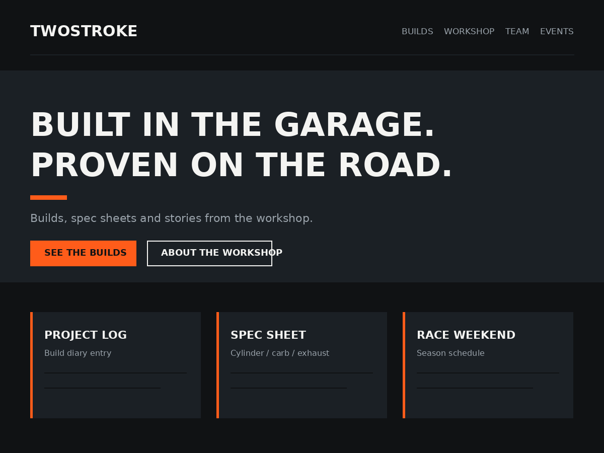

# TwoStroke

**A free, 100 % GPL WordPress block theme for the scooter & moped scene** — builders, tuning workshops, racing teams and riding clubs.

## Features

- **8 ready-made block patterns:** garage hero, technical spec sheet (cylinder, carb, exhaust, gearing …), build story, before/after comparison, team roster, event schedule, sponsor row, workshop info
- **2 looks:** dark garage design + light "Workshop" style variation
- **8 templates** including a landing template without page title
- **Fast & privacy-friendly:** system fonts only, no remote resources, no tracking
- **Fully translatable** — complete German translation included (`de_DE`)
- **Full Site Editing:** header, footer and all templates editable in the block editor

## Requirements

- WordPress 6.5+
- PHP 7.4+

## Installation

1. Download the [latest release](../../releases/latest) ZIP
2. In WordPress: *Appearance → Themes → Add New → Upload Theme*
3. Activate, create a page with the "Landing (no title)" template and start with the "Hero: Garage" pattern (block inserter → category *TwoStroke: Garage*)

## Links

- **Theme page & docs:** https://blog.racing-planet.de/themes/twostroke/
- **All themes:** https://blog.racing-planet.de/themes/
- WordPress.org: *link follows after directory approval*

## License

GPLv2 or later — free to use, modify and redistribute, including commercially. See [LICENSE](LICENSE).

Developed and maintained by [Racing Planet](https://www.racing-planet.de/).
